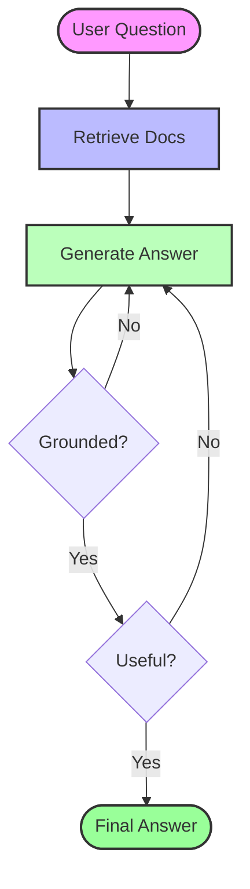

# AI Knowledge Inbox

A minimal, production-ready web application that functions as a "Second Brain". Save notes and URLs, and use an Agentic RAG (Retrieval-Augmented Generation) pipeline to ask intelligent questions over your personal knowledge base.

## Features

- 📝 **Smart Ingestion**: tailored inputs for text Notes and Web Pages (URLs).
- 🧠 **Agentic RAG**: Uses **LangGraph** for a self-correcting QA pipeline (Retrieval → Generation → Hallucination Check → Answer Quality Check).
- 🎨 **Minimalist UI**: Clean, distraction-free interface with a **Masonry Grid Layout**.
- 🔍 **Semantic Search**: Find relevant information using vector embeddings (ChromaDB).
- ⚡ **Fast & Private**: Uses local embeddings (`all-MiniLM-L6-v2`) and efficient in-memory processing.
- 📱 **Responsive**: Fully responsive design with sidebar navigation.

## Tech Stack

### Backend
- **FastAPI**: High-performance Python web framework.
- **LangGraph**: State-based orchestration for the RAG pipeline.
- **ChromaDB**: Embedded vector store for semantic retrieval.
- **Groq API**: Ultra-fast inference using **Llama 3.3 70B Versatile**.
- **Sentence Transformers**: Local embedding generation.
- **BeautifulSoup4**: Robust web content extraction.

### Frontend
- **React 18**: Component-based UI.
- **Tailwind CSS v3**: Utility-first styling.
- **Vite**: Next-generation frontend tooling.
- **Lucide React**: Beautiful open-source icons.

## Setup Instructions

### Prerequisites
- Python 3.9+
- Node.js 18+
- [Groq API Key](https://console.groq.com/keys) (Free)

### 1. Backend Setup

Navigate to the backend directory and set up the Python environment:

```bash
cd backend
python -m venv venv

# Activate virtual environment
# Windows:
venv\Scripts\activate
# Mac/Linux:
source venv/bin/activate

# Install dependencies
pip install -r requirements.txt
```

Create a `.env` file in the `backend/` directory:

```env
GROQ_API_KEY=gsk_your_actual_key_here
```

Start the backend server:

```bash
python main.py
# Server runs at http://localhost:8000
```

### 2. Frontend Setup

Open a new terminal, navigate to the frontend directory, and start the UI:

```bash
cd frontend
npm install
npm run dev
# App runs at http://localhost:5173
```

## Usage Guide

1.  **Add Content**: Click the **"+ New"** button.
    *   **Note**: Type plain text (ideas, tasks, facts).
    *   **URL**: Paste a link (e.g., a blog post or documentation). The app will automatically scrape and index the text.
2.  **View Items**: Your saved items appear in a Pinterest-style masonry grid.
3.  **Ask Questions**: Click on any item to open the **Query Modal**.
    *   Type a question about that specific item.
    *   The Agentic RAG will analyze the content and provide an answer, citing its sources.
4.  **Manage**: Delete items or use the filters (Notes vs URLs) to organize your board.

## System Design Patterns

This application utilizes two key architectural patterns:

### 1. Client-Server Architecture (Separation of Concerns)
*   **Frontend (Client)**: React/Vite SPA (Single Page Application). Handles presentation, state, and user interaction.
*   **Backend (Server)**: FastAPI REST API. Handles business logic, data persistence, and AI orchestration.
*   **Communication**: JSON over HTTP.

### 2. Self-Reflective RAG (Agentic Design)
Instead of a linear "Retrieve-then-Generate" pipeline, the system uses a **State Machine** (via LangGraph) to implement **Self-Correction**:
*   **Reflection**: The model grades its own answers for "Groundedness" (fact-checking against docs) and "Quality" (does it answer the question?).
*   **Looping**: If quality checks fail, the system loops back to re-generate the answer, improving reliability.

## Architecture: Agentic RAG

Unlike simple RAG, this project uses a graph-based approach (`rag_pipeline.py`):

1.  **Retrieve**: Fetches top-k relevant chunks from ChromaDB.
2.  **Generate**: LLM answers the question using strictly the retrieved context.
3.  **Grade Groundedness**: A tailored LLM call checks if the answer is supported by facts.
    *   *If No*: It retries generation.
4.  **Grade Quality**: Checks if the answer actually resolves the user's question.
    *   *If No*: It retries generation.
    *   *If No*: It retries generation.

### Workflow Diagram



## Project Structure

```
TURIUM/
├── backend/
│   ├── main.py              # API Entry point
│   ├── rag_pipeline.py      # LangGraph RAG Agent
│   ├── content_fetcher.py   # Web scraper
│   ├── database.py          # ChromaDB & SQLite check
│   └── requirements.txt     # Python deps
│
├── frontend/
│   ├── src/
│   │   ├── components/
│   │   │   ├── IngestForm.jsx      # 'New Item' inputs
│   │   │   ├── ItemsList.jsx       # Masonry grid display
│   │   │   └── QueryModal.jsx      # Chat with content
│   │   ├── App.jsx          # Main layout & state
│   │   └── api.js           # API calls
│   └── tailwind.config.js
│
└── README.md
```

## License
MIT
